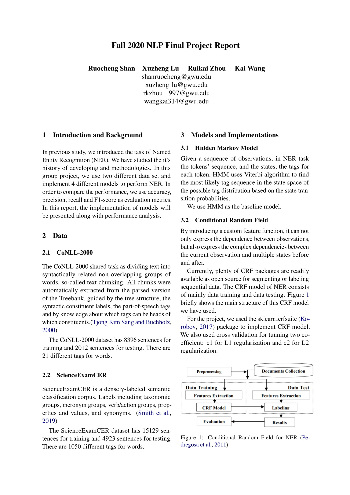

# NLP - Named Entity Recognition (NER)
This project implemented 4 models for the Named Entity Recognition tasks:
1. HMM
2. CRF
3. LSTM + CRF
4. BERT

We used two datasets for testing:
1. CoNLL-2000
2. ScienceExamCER

The details of the experiments and results are in the docs/report.pdf file.

### Results and Reports

